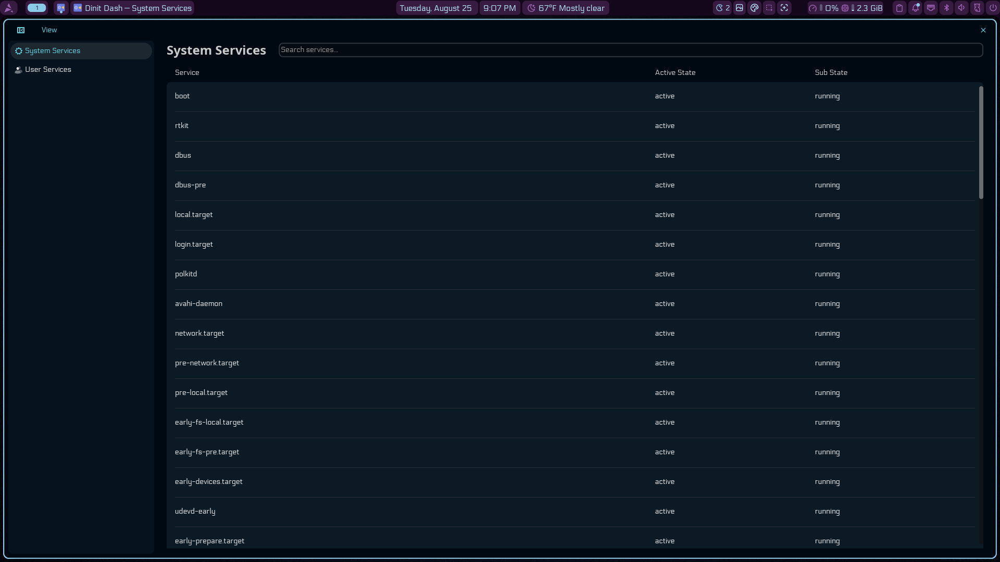

# Dinit Dash



A modern service manager GUI for [Dinit](https://davmac.org/projects/dinit/), ported from
[CTL Dash](https://github.com/nikelaz/ctldash) (which talks to systemd over D-Bus).

Dinit Dash talks to Dinit over its native control socket via `dinitctl` — no D-Bus involved.
It shows every loaded service with its state, lets you start / stop / restart / enable /
disable services, and shows a service's buffered log output.

Built with the [COSMIC](https://github.com/pop-os/libcosmic) app library.

## Credits

Dinit Dash is a **port** of [CTL Dash](https://github.com/nikelaz/ctldash) by
[nikelaz](https://github.com/nikelaz), reworked to manage **dinit** services
instead of systemd. It is not a fork: the original talks to systemd over D-Bus;
this project talks to dinit over its native control socket via `dinitctl`, and
the backend, elevation, and log handling are entirely new. The UI design
lineage is preserved from the original under the same license (MPL-2.0).


### Works on any desktop

The [COSMIC](https://github.com/pop-os/libcosmic) **app library** is just the
GUI toolkit (the equivalent of GTK or Qt) — it is **not** the COSMIC desktop
shell. Dinit Dash runs as a normal window on any Linux desktop:

- **Wayland sessions** (GNOME, KDE, Hyprland, sway, COSMIC, …) — native path
- **X11/Xorg** — the toolkit falls back to X11 automatically

You do **not** need cosmic-session, cosmic-panel, or any other COSMIC desktop
component installed. If a `~/.config/cosmic` theme is present it is used;
otherwise the app uses its own default theme. The only hard system requirement
is **dinit itself** — on systemd there is nothing to manage.

## Features

- System **and** user service scopes (toggle in the sidebar)
- Live service list: name, active/sub state (both state columns)
- Service detail pane: state, PID, unit file path, enabled/disabled
- Start / stop / restart / enable / disable actions
- Log viewer: in-memory buffer (`dinitctl catlog`) **or** the service's
  `logfile` tail (whichever the service defines)
- Light/dark/system theme (COSMIC)
- English, Bulgarian, and Czech localisation

## Building

Requires Rust (stable) and `cargo`.

### System dependencies

**Artix (or Arch):**

```sh
sudo pacman -S --needed base-devel rust cargo pkg-config \
    gtk3 libxkbcommon libxkbcommon-x11 wayland openssl
```

**Debian/Ubuntu (or other):**

```sh
sudo apt install build-essential pkg-config libssl-dev libgtk-3-dev \
    libxkbcommon-dev libwayland-dev libudev-dev
```

> The build pulls `libcosmic` from git (rev-pinned). A `Cargo.lock` pins every
> transitive dependency — including `cosmic-text` — to known-good commits, so
> builds are reproducible. If you ever hit an "API changed" error in a transitive
> crate, `cargo update` that crate against the lockfile.

### Build & run

```sh
cargo run --release
```

## System services and permissions

Dinit is **stricter than systemd**: the system control socket is created
root-only (`0600`), so a non-root user **cannot** query or control system
services at all — this is by design in dinit, not a limitation of Dinit Dash.

Dinit Dash handles it automatically: for system-scope operations it elevates
through the first available of **pkexec (polkit), doas, sudo**, or
`flatpak-spawn --host pkexec` inside a Flatpak sandbox. `pkexec` is preferred
because it shows the desktop's **graphical authentication dialog** instead of
prompting in the terminal. You'll be prompted for your password only when you
actually operate on system services.

For the graphical polkit dialog to appear, your desktop session must run a
**polkit authentication agent** (GNOME ships `polkit-gnome`, KDE ships
`polkit-kde-agent`, etc. — almost every desktop has one running by default).
If no agent is running, `pkexec` falls back to a terminal prompt.

User-scope services need no elevation.

### If you prefer a group-based setup (no password prompts)

A common dinit deployment pattern (per
[dinit documentation](https://davmac.org/projects/dinit/)) is to run the
system manager with its control socket owned by a group your user belongs to:

1. `sudo groupadd dinitctl && sudo usermod -aG dinitctl $USER`
2. Re-login so the group applies.
3. Start dinit with a custom socket path in a group-writable directory (see
   dinit's `--socket-path` option) — the daemon sets the socket perms at bind
   time. Dinit Dash will then talk to system services without elevation.
4. Remove yourself from the group when done testing if you don't want the
   permissions permanently.

> Note: dinit's *default* system socket is hardcoded `0600` in dinit's source
> (`src/dinit.cc`); there is no runtime option to relax it. The group setup
> above only works when dinit is configured to bind a socket in a
> group-writable location. Dinit Dash's polkit path works with the default
> socket, so most users should not need any of this.

## Configuration

| Environment variable      | Meaning                                        |
|---------------------------|------------------------------------------------|
| `DINIT_DASH_DINITCTL`     | Path to the `dinitctl` binary (default: `dinitctl` on `PATH`) |

## License

MPL-2.0 (same as the original CTL Dash).
